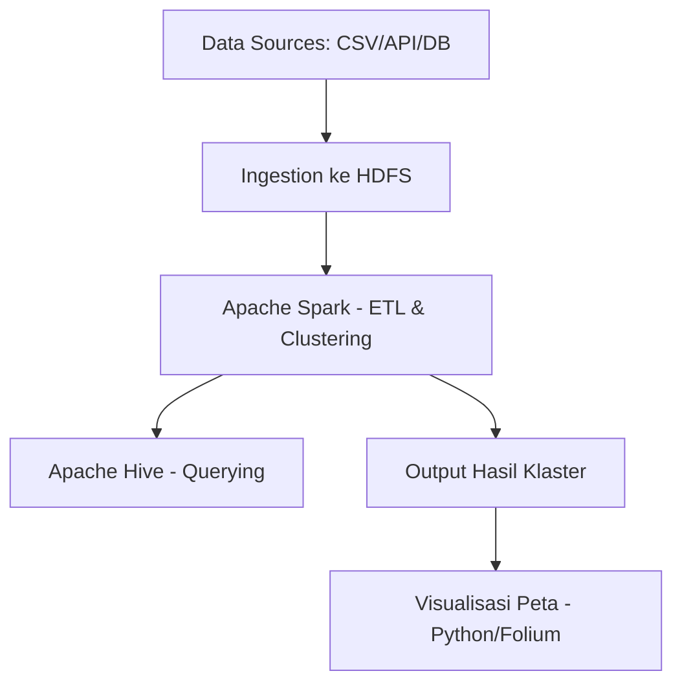

# 🐟 Analisis Produk Hasil Laut Sumatera

Proyek ini bertujuan untuk menganalisis data hasil laut dari berbagai kabupaten/kota di wilayah Sumatera menggunakan teknologi **Big Data**, khususnya **Hadoop Stack dan Apache Spark MLlib**. Fokus utama proyek ini adalah melakukan **klasterisasi wilayah** berdasarkan volume dan nilai produksi hasil laut, serta menyajikannya dalam bentuk visualisasi peta sebaran.

---
## Nama Kelompok
- Putri Maulida Chairani		(121450050)
- Nawwaf Abdurrahman		    (122450018)
- Syadza Puspadari Azhar		(122450072)
- Dearni Monica Br Manik		(122450075)
- Ratu Keisha Jasmine Deanova	(122450106)
---

## 🚀 Teknologi yang Digunakan

- **Apache Hadoop** – Distributed storage dengan HDFS
- **Apache Spark** – Pemrosesan data dan ML (KMeans Clustering)
- **Apache Hive** – Query data dalam HDFS
- **Python (Folium, Geopandas)** – Visualisasi data spasial
- **Jupyter Notebook / PySpark Script** – Analisis dan pipeline
- **GitHub Actions** *(opsional)* – CI/CD pipeline untuk workflow

---

## 🧱 Arsitektur Proyek

## Sistem Arsitektur Data
| **Lapisan** | **Deskripsi** | **Komponen Utama (Tools)** | **Format Data** | **Tujuan** |
| ----------- | ------------- | -------------------------- | --------------- | ---------- |
| **Bronze**  | Menyimpan data mentah dari sumber seperti API/CSV, tanpa transformasi.                                                             | - Apache Flume    - HDFS                                         | CSV             | Arsip permanen dari data eksternal tanpa perubahan |
| **Silver**  | Menyimpan data yang telah dibersihkan dan diproses, misalnya penghapusan duplikat, parsing tanggal, validasi, dan konversi format. | - Apache Spark (PySpark)   - HDFS   - Hive (DDL)   - HBase | Parquet / Avro  | Data siap dianalisis: bersih dan terstruktur       |
| **Gold**    | Menyimpan data hasil agregasi dan klasterisasi, siap divisualisasikan.                                                             | - Apache Spark (MLlib)   - Hive (Query)   - Python Folium     | Parquet / ORC   | Visualisasi spasial untuk analisis akhir           |

